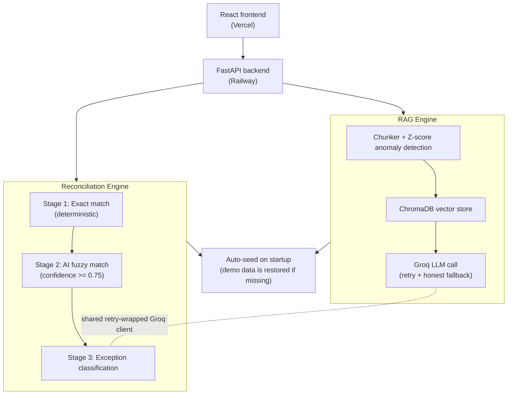

# ZFinance

**An AI Finance Controller for SMBs - reconciles financial records, detects anomalies, and explains business financial health in plain language.**

🔗 **Live app:** https://z-finance-flame.vercel.app
🔗 **API:** https://zfinance-production.up.railway.app
🔗 **API docs:** https://zfinance-production.up.railway.app/docs

---

## The problem

Small businesses have financial data like bank statements, ledgers, transaction history but data isn't the same as understanding. Two specific gaps:

1. **Reconciliation is manual and error-prone.** Matching internal records against bank statements means catching duplicate payments, missing entries, settlement delays, and split transactions by eye. This doesn't scale past a handful of transactions and genuine mistakes slip through.
2. **Raw numbers don't explain themselves.** A business owner without a finance background can see "margin dropped 5%" but not *why*, or which transactions actually drove it.

ZFinance follows a **deterministic-first architecture**: financial arithmetic, matching logic, and anomaly calculations are performed by code. AI is used for ambiguous reconciliation cases and for explaining verified results in plain language.

---

## What it does

### Reconciliation engine
A three-stage pipeline that matches an internal ledger against a bank statement:

1. **Exact match** - deterministic, amount + date + reference ID. No AI involved. Fast, free, handles the obvious majority.
2. **AI-assisted fuzzy match** - for records that don't exactly match (settlement delays, fee deductions, truncated bank descriptions), an LLM evaluates candidates and only accepts a match above a 0.75 confidence threshold.
3. **Exception classification** - anything still unmatched gets classified into a specific category (missing from bank, split transaction, duplicate payment, unknown) with plain-English evidence, not silently dropped or force-matched.

### AI financial dashboard
- **Weekly narrative** - plain-English summary of what changed and why, grounded in retrieved transaction data (RAG), not free-generated text
- **Anomaly detection** - Z-score based, flags category spending that deviates significantly from historical average
- **Health score** - composite 0–100 score across margin, growth, and stability
- **Ask ZFinance** - natural-language Q&A grounded in the business's actual ingested data

---

## Evaluation results

Benchmarked against a 55-record synthetic dataset with 24 labeled ground-truth mismatches across 6 categories (amount discrepancy, date shift, description mismatch, split transaction, missing from bank, duplicate payment). Reproducible via `python benchmark.py`.

> **Important:** These accuracy figures are measured on this specific
> 55-record synthetic fixture and should not be interpreted as production
> accuracy. Real-world bank exports have substantially more variability.

| Metric | Result |
|---|---:|
| Records | 55 |
| Exact matches (deterministic) | 38 |
| AI-assisted (fuzzy) matches | 11 |
| Unresolved (flagged for human review) | 6 |
| Match rate | 89.1% |
| Precision (needs-review detection) | 100.0% |
| Recall (needs-review detection) | 100.0% |
| Exception classification accuracy | 100.0% |
| Auto-resolution accuracy | 100.0% |
| Duplicate detection accuracy | 100.0% |
| Runtime (full dataset) | 39.8s |

> **Benchmark note:** Stage 2 and Stage 3 make real Groq API calls, so
> benchmark runtime and AI-assisted results can vary with model/provider
> availability and latency.

**Metric definitions:**
- **Precision / Recall** - positive class is "this record genuinely requires human review" (split transactions, missing-from-bank, duplicate payments). Precision of everything flagged for review, how much genuinely needed it. Recall = of everything that genuinely needed review, how much was caught.
- **Exception classification accuracy** of records correctly flagged for review, how many received the correct exception type label.
- **Auto-resolution accuracy** of records with cosmetic noise (fee differences, settlement delays, description truncation), how many were correctly resolved automatically without needlessly escalating to a human.

No false positives or false negatives on this benchmark run. Full raw output: [`benchmark_results.json`](backend/benchmark_results.json).

---

## Architecture



**Key design decisions:**

- **Deterministic-first, AI-second.** Exact matching, Z-score calculations, and financial arithmetic all run in plain Python,never delegated to the LLM. The LLM is only invoked for genuinely ambiguous cases (fuzzy matching) and for turning verified numbers into natural language (narrative, Q&A). Keeping arithmetic and exact matching deterministic removes an important source of LLM error from the reconciliation path. The remaining AI-assisted steps are evaluated separately against labeled ground truth.
- **Honest failure handling.** Every LLM call is wrapped with retry-and-backoff for transient failures (rate limits, network blips) and a graceful, explicit fallback for genuine outages the system returns `"AI temporarily unavailable"` rather than crashing or fabricating an answer. Verified by [`test_llm_failure.py`](backend/test_llm_failure.py), which deliberately breaks the API key and confirms every code path degrades cleanly.
- **Self-healing demo data.** The backend auto-seeds its demo dataset on startup if missing, so the live deployment shows real data immediately rather than empty states. The deployed demo can restore its bundled synthetic dataset on startup if local vector data is missing.
- **Ephemeral demo storage.** The deployed prototype uses local vector storage and startup seeding rather than a persistent production database. Uploaded data should not be treated as durable across redeployments.

## Why AI?

AI is deliberately used only where deterministic rules become insufficient.

| Task | Approach |
|---|---|
| Exact transaction matching | Deterministic |
| Financial arithmetic | Deterministic |
| Z-score anomaly detection | Deterministic |
| Ambiguous transaction matching | AI-assisted |
| Exception classification | AI-assisted |
| Financial narrative | RAG + AI |
| Natural-language questions | RAG + AI |

This keeps the system verifiable while using AI where contextual
reasoning adds value.

---

## Tech stack

**Backend:** FastAPI (Python), ChromaDB (vector store), sentence-transformers (`all-MiniLM-L6-v2`), Groq (`openai/gpt-oss-20b`), pandas/numpy, rapidfuzz
**Frontend:** React + TypeScript + Vite, Tailwind CSS v4, Recharts, lucide-react
**Deployment:** Railway (backend), Vercel (frontend)

---

## Local setup

```bash
# Backend
cd backend
python -m venv .venv
.venv\Scripts\activate          # Windows
pip install -r requirements.txt
cp .env.example .env            # add your GROQ_API_KEY
uvicorn main:app --reload --port 8000

# Frontend (new terminal)
cd frontend
npm install
echo "VITE_API_URL=http://localhost:8000" > .env.local
npm run dev
```

Run the benchmark yourself:
```bash
cd backend
python benchmark.py
```

Run the LLM-failure resilience test:
```bash
cd backend
python test_llm_failure.py
```

---

## Limitations

Being upfront about what this is and isn't:

- **Synthetic evaluation data.** The 55-record benchmark is a generated fixture with known ground truth, not a live business's real bank export. Real-world data (multi-currency, partial refunds, hundreds of bank export formats) hasn't been tested against.
- **Single business, no multi-tenancy.** The deployed instance uses one hardcoded `business_id`. No authentication, no user accounts.
- **Manual CSV upload, no bank feed integration.** No Plaid or direct bank API, data comes from CSV export/import.
- **No persistent billing or usage limits.** This is a working prototype, not a metered product.

## Roadmap

- Bank-feed integrations to replace manual CSV upload
- Multi-tenant auth (Clerk) + real user/business accounts (Postgres)
- Stripe billing with usage-based tiers
- Validation against real, messy bank export data from multiple banks
- Evidence-linked UI - click any AI claim to see the exact transactions it's based on

---

## Repository structure

```
ZFinance/
├── backend/
│   ├── main.py                    # FastAPI app, CORS, auto-seed startup
│   ├── benchmark.py                # Reproducible evaluation script
│   ├── test_llm_failure.py         # Deliberate LLM-outage resilience test
│   ├── rag/                        # Narrative, health score, anomalies, Q&A
│   ├── reconciliation/             # 3-stage matching pipeline
│   └── data/                       # Synthetic test fixtures + ground truth
└── frontend/
    └── src/
        ├── screens/                # Overview, Transactions, Reconciliation, Ask, Settings
        ├── components/             # Shared UI (Button, Chip, ErrorState, DropZone)
        └── lib/api.js               # Backend API client
```

---